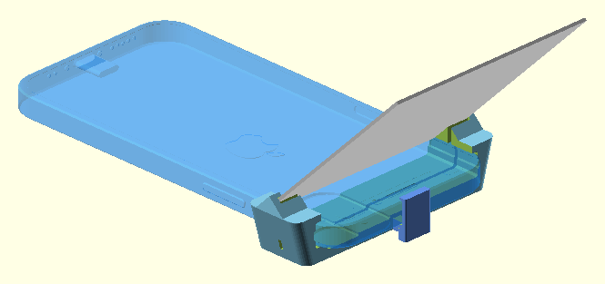
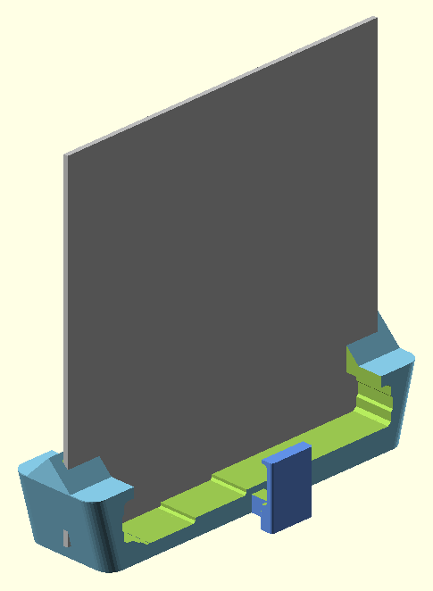

# iPhone 12 mini TrueDepth Periscopic Face ID 3D Scanning Mount





A 3D-printed mount to turn an iPhone 12 mini into a dedicated forward-facing Face ID scanner, designed for use with the [Heges 3D Scanner](https://hege.sh/) app. [EM3D Scanner App](https://em3dscanningapp.com/) might also be a good alternative too as it has a decent trial but I haven't tried it yet.

The iPhone 12 mini is an ideal candidate for this because it can often be found cheaply on the used market. Even units with battery damage, non-OEM screens, or cosmetic wear (like being "chewed on by a dog") are perfect, as long as the Face ID sensor is functional.

Real world though? Good for a snapshot or two after a bit. Large flat surfaces can show bends. But the sensors on the iPhone 12 mini seem to bug out. Not sure if it's due to my crap-condition iPhone 12 mini's battery bugging out and heating things to madness and so on. Don't be expecting to scan some engines or whatevers with this. Get a real scanner. This is for small things and poor budgets and/or drawer phones you might already have. 

## Features

*   **Precise Fit:** Designed specifically for the iPhone 12 Mini.
*   **Face ID Clearance:** Cutout ensures Face ID sensors (flood illuminator, dot projector) are unobstructed.
*   **Dual Modes:**
    *   **Usage Mode:** Holds the mirror at 45 degrees for scanning.
    *   **Storage Mode:** Vertical front slot to store the mirror flat with the base for compact transport.
*   **Non-Destructive:** No adhesive required on the phone.

## Hardware Needed

-   [3x3 Inch Square Mirrors (this kit has more than that too)](https://amzn.to/4rF7oln)
-   [iPhone 12 Mini (Amazon)](https://amzn.to/4aF0Vkh)
    - Of course, you can get it from other places like eBay.

## Ready to Print?

Use `./mount.stl` for printing.

Want to build it yourself? Follow the instructions below.

## Prerequisites

To build and modify this project, you will need:

-   [OpenSCAD](https://openscad.org/) (installed and in your PATH, or adjustable in the Makefile)
-   `make` (standard on macOS/Linux)

## Build Instructions

This project uses a `Makefile` to automate the generation of STL files and preview images.

1.  **Clone the repository:**
    ```bash
    git clone <repository-url>
    cd iphone_12_mini_face_id_mount
    ```

2.  **Build everything (STL and PNGs):**
    ```bash
    make
    ```

3.  **Build only the STL for printing:**
    ```bash
    make stl
    ```
    The output file will be `mount.stl`.

4.  **Clean up generated files:**
    ```bash
    make clean
    ```

## Printing Settings

-   **Layer Height**: 0.16mm Standard @BBL
-   **Variable Layer Height**: Enabled (Adaptive)
    -   When applying variable layer height, move the slider all the way to "Quality".

This should result in a snug fit for the iPhone 12 Mini and the mirror.


## File Structure

-   `mount.scad`: The core parametric design file.
-   `Makefile`: Build automation script.
-   `reference/`: Contains the reference STL for the iPhone 12 Mini.
-   `preview_*.png`: Generated preview images of the model.

## Inspirations

-   [Original Concept on Thingiverse](https://www.thingiverse.com/thing:3254381)
